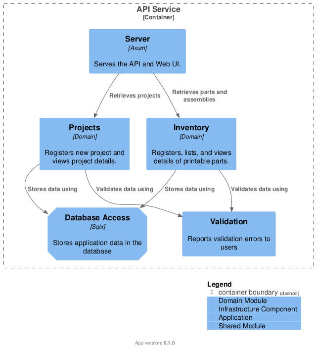
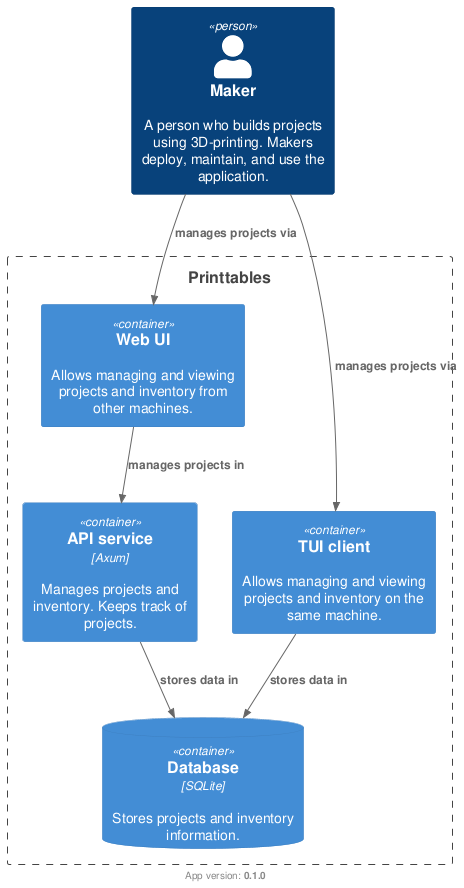

# Components View

| Attribute   | Value |
|-------------|-------|
| App version | 0.1.0 |

## Primary View


*Components diagram*

The system consists of domain and infrastructure modules.

### Domain modules

Domain modules serves different bounded contexts. The *projects* module handles printing projects. The not yet implemented *inventory* module keeps assemblies and parts user can add to project.

Domain modules will need to collaborate and exchange information in the future. A decision on cross-module communication is not yet taken.

Domain modules are not pure business logic. Currently they contain a part of the infrastructure implementing driven and driver ports. Check the projects module for example.

```
projects <module root>
  +-- app     - application services coordinating domain operations
  +-- domain  - domain entities and values
  +-- infra   - implementation of domain concerns, like REST endpoints and persistence
    +-- axum  - REST handlers 
    +-- sqlx  - domain repository implemented using sqlx library
```

The infrastructure part may be moved outside of the domain level in future.

### Infrastructure modules

The *server* module is what binds the application together. It implements the API service. The server module initializes web server, database connection, logging, and other necessary infrastructure. 

### Cross-cutting concerns

The approach to cross-cutting concerns is yet to be established. The closest analysis candidates are:

- Validation
- Transaction management

The validation helpers is defined in the projects module domain layer. However, some of the definitions must be shared across all domain modules.

Transaction management is expected to reside in application services.

## Context view



All components belong to the API service of Printtables.
Domain modules will be shared with CLI tool later in the development cycle.

## Rationale

Domain module separation into projects and inventory modules is artificial. The intent is to establish a mental framework where different domain items are decoupled from each other. It simplifies making smaller steps during the system development.

While the separation is beneficial in the early stages, it may become an overkill later. Merging domain modules is pretty much on the table. There are no plans to separate any subdomain into own deliverable. The project scope is too small.

Isolating infrastructure addresses two concerns:

- Low Rust expertise of system developers.
- Volatility of relatively young Rust solutions.

The separation of infrastructure concerns aims to simplify changing implementation libraries. The downside is increased level of traits and often providing only one trait implementation. Note that the topic of mock testing remains unexplored. More abstractions might benefit the testing.

