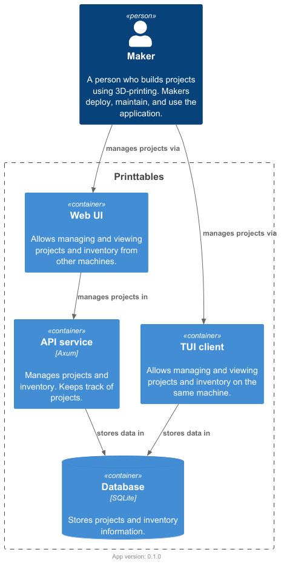

# Application structure

| Attribute   | Value |
|-------------|-------|
| App version | 0.1.0 |

## Main view

The diagram below shows a logical structure of the application.

As of now, all the components coexist in a single code base to speed up development.
