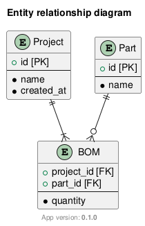

# Entity Relationship

## Entity Relationship Diagram

The very first version of printtables allows to create orders for multiple parts.

## Elements

| Element | Description |
|---------|-------------|
| Project | A group of parts that are ordered together. |
| Part | A single item that is ordered. |
| Order | A table to define how many items of each type are necessary to complete a project |